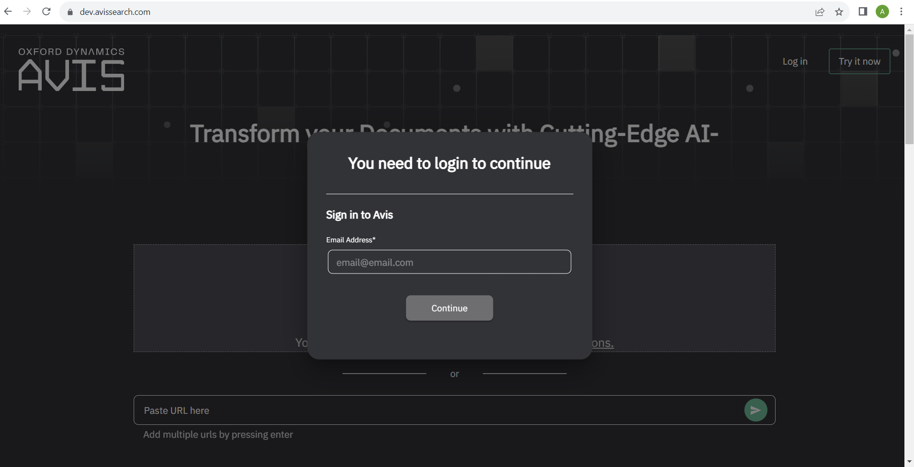
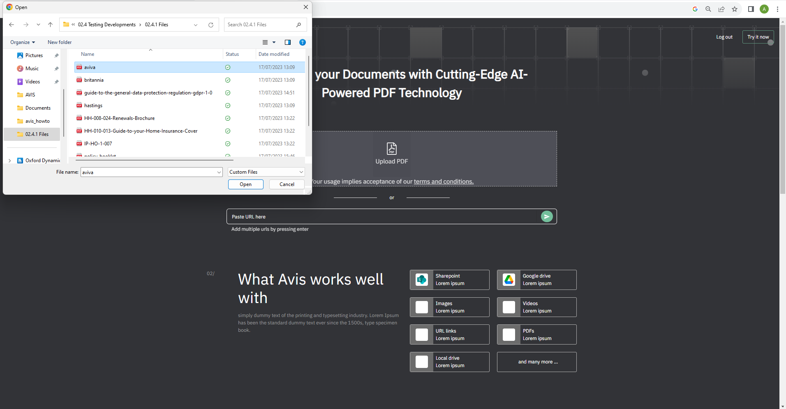
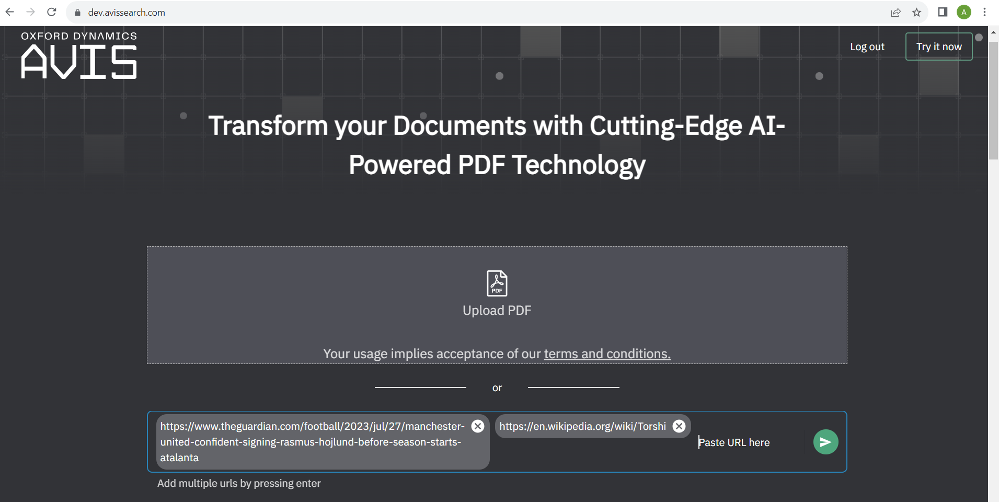
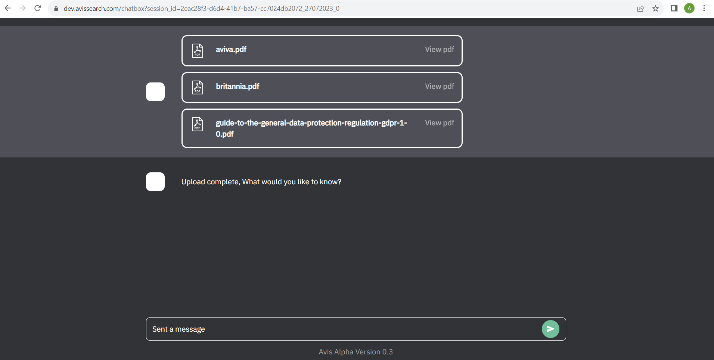
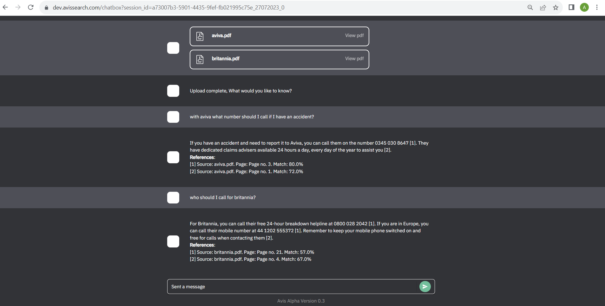

# How To Use AVIS

## Intro
AVIS is an intelligent search interrogation software that utilises the power of AI and NLP.
The website is currently under development, as such, certain features may not be available or fully working.

## Demo 🎥:

embedded video

## Getting started 🚀:
### 1. 
Login to the website by agreeing to the terms and conditions, then create a one-time password (this may go to your junk email folder)

### 2. a) Files
   To use documents, click the Upload PDF box and select your documents from the explorer. To select multiple documents, hold CTRL and click each document.

   
### 2. b) URLS
   To use websites, paste the link to the website in the bar shown. Press enter to include multiple URLs. Then press the ready button.

### 3. 
Once the files/URLs have loaded, you can ask your question in the search bar.

   :+1: Questions can be specific to the documents/URLs (as shown in the below example) and AVIS will provide the answer with the reference from which source, where in the source, and how confident the response is.

